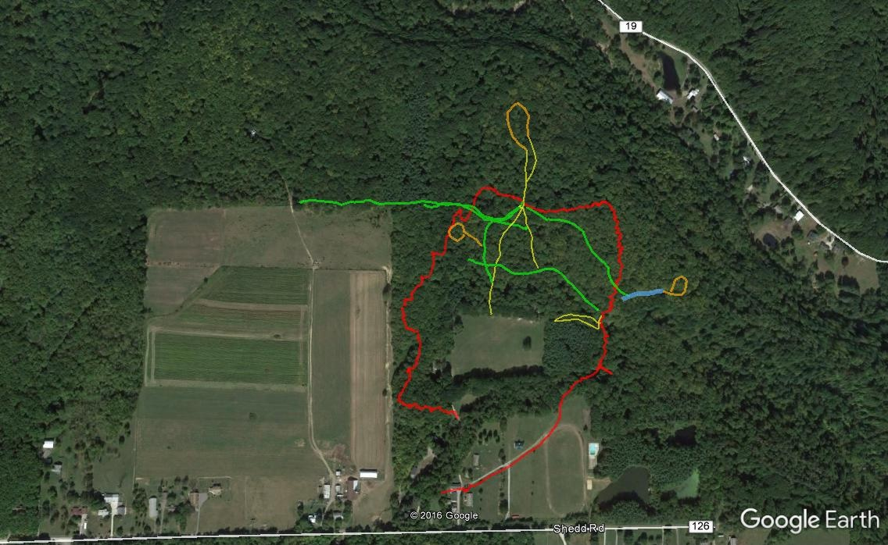

From email from M. Bej on 2017-03-20:
> 
> 
> The red line is a new proposed access road.
> 
> You'll note if you zoom in close that this is still GPS, with inherent
> error - you'll see 2 traces crossing the wooden bridge near the Sugar Shack
> that not on the bridge at all, but 10-15 feet to the west. I went out in
> winter on purpose, so that tree cover would be minimal, but I think the
> signal is still bouncing off the trees.
>
> Notice, also, the yellow trace from the sugar shack to the new barracks.
> This is 2 trips over the same ground, except at the very eastern part where
> I took the new, uneroded path. And this was an out-and-back within minutes.
