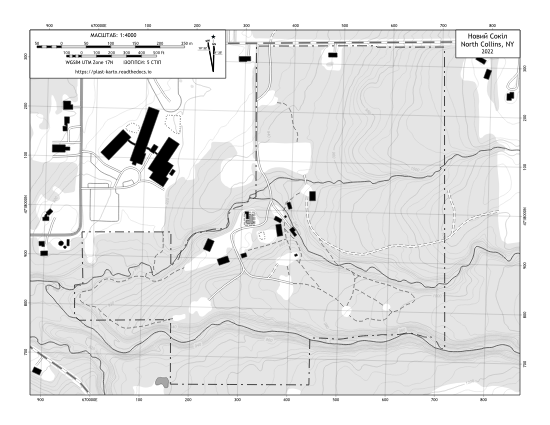

Новий Сокіл
===========

Color "USGS style" Topo
-----------------------
Mimics color schemes and symbols used in the popular and familiar USGS topo map
series.

`Download 8.5x11 PDF <https://github.com/amykyta3/plast-karto/releases/latest/download/NovijSokil-USGS-8.5x11.pdf>`__

.. image:: ../NovijSokil/rendered/NovijSokil-USGS-8.5x11-thumb.png

Black & White Topo
------------------
Optimized for inexpensive black and white printing. Should hold up to
photocopying as well.

`Download 8.5x11 PDF <https://github.com/amykyta3/plast-karto/releases/latest/download/NovijSokil-greyscale-8.5x11.pdf>`__

Data Sources and Attributions
-----------------------------
* Map author: Олесь Микита
* On-site surveys:

    * Лукаш Левицький - GPS Tracks & descriptions
* Imagery and LiDAR datasets:

    * `NYS GIS Clearinghouse <http://gis.ny.gov>`_
    * nysdop5, nysdop7, nysdop8 Orthoimagery
    * NYSGPO LiDAR

* Parcel Boundaries:

    * `NYS GIS Clearinghouse Parcels <http://gis.ny.gov/parcels/>`_
