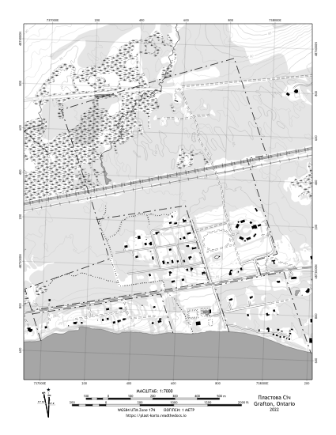

Пластова Січ
============

Color "USGS style" Topo
-----------------------
Mimics color schemes and symbols used in the popular and familiar USGS topo map
series.

Full Map
^^^^^^^^

.. list-table::
    :header-rows: 1

    *   - Page Size
        - Map Scale
        -
    *   - 8.5 x 11 (Letter)
        - 1:7000
        - `Download <https://github.com/amykyta3/plast-karto/releases/latest/download/PlastovaSich-USGS-8.5x11.pdf>`__

Inset
^^^^^

.. list-table::
    :header-rows: 1

    *   - Page Size
        - Map Scale
        -
    *   - 8.5 x 11 (Letter)
        - 1:3500
        - `Download <https://github.com/amykyta3/plast-karto/releases/latest/download/PlastovaSich-USGS-inset-8.5x11.pdf>`__

Black & White Topo
------------------
Optimized for inexpensive black and white printing. Should hold up to
photocopying as well.

Full Map
^^^^^^^^

.. list-table::
    :header-rows: 1

    *   - Page Size
        - Map Scale
        -
    *   - 8.5 x 11 (Letter)
        - 1:7000
        - `Download <https://github.com/amykyta3/plast-karto/releases/latest/download/PlastovaSich-greyscale-8.5x11.pdf>`__

Inset
^^^^^

.. list-table::
    :header-rows: 1

    *   - Page Size
        - Map Scale
        -
    *   - 8.5 x 11 (Letter)
        - 1:3500
        - `Download <https://github.com/amykyta3/plast-karto/releases/latest/download/PlastovaSich-greyscale-inset-8.5x11.pdf>`__

Corner Ruler UTM Grid Tool
--------------------------

Measure & plot UTM coordinates. This "roamer style" grid tool kit is custom-made
to include rulers for the 1:7000 and 1:3500 scales used in the Пластова Січ map set.

**Instructions:**
    * :download:`Download PDF <../tools/utm-tool/UTM-roamer-ruler-Sich.pdf>`
    * Print out onto 8.5x11 transparency film
    * Cut out individual grid tools
    * Punch out the three small pencil-holes (use a nail or drill)
    * Punch out the lanyard hole with a standard hole punch
    * `Learn how to use UTM Coordinates <https://www.maptools.com/tutorials/utm/quick_guide>`__

.. figure:: utm-ruler-thumb.png

    Cut marks shown in red

Data Sources and Attributions
-----------------------------
* Map author: Олесь Микита
* Imagery and LiDAR datasets:

    * `Ontario Classified Point Cloud LiDAR Dataset <https://geohub.lio.gov.on.ca>`_
    * `2018 SCOOP Aerial Imagery <https://maps.northumberlandcounty.ca/MunicipalServices/>`_
* Parcel Boundaries:

    * Пласт Toronto Archive
