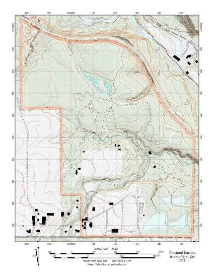

Писаний Камінь
==============

Color "USGS style" Topo
-----------------------
Mimics color schemes and symbols used in the popular and familiar USGS topo map
series.

.. list-table::
    :header-rows: 1

    *   - Page Size
        - Map Scale
        -
    *   - 8.5 x 11 (Letter)
        - 1:4500
        - `Download <https://github.com/amykyta3/plast-karto/releases/latest/download/PysanyjKamin-USGS-8.5x11.pdf>`__
    *   - 24 x 36 (Arch D)
        - 1:1500
        - `Download <https://github.com/amykyta3/plast-karto/releases/latest/download/PysanyjKamin-USGS-24x36.pdf>`__

Black & White Topo
------------------
Optimized for inexpensive black and white printing. Should hold up to
photocopying as well.

.. list-table::
    :header-rows: 1

    *   - Page Size
        - Map Scale
        -
    *   - 8.5 x 11 (Letter)
        - 1:4500
        - `Download <https://github.com/amykyta3/plast-karto/releases/latest/download/PysanyjKamin-greyscale-8.5x11.pdf>`__

Corner Ruler UTM Grid Tool
--------------------------

Measure & plot UTM coordinates. This "roamer style" grid tool kit is custom-made
to include rulers for the 1:4500 and 1:1500 scales used in the Писаний Камінь map set.

**Instructions:**
    * :download:`Download PDF <../tools/utm-tool/UTM-roamer-ruler-PK.pdf>`
    * Print out onto 8.5x11 transparency film
    * Cut out individual grid tools
    * Punch out the three small pencil-holes (use a nail or drill)
    * Punch out the lanyard hole with a standard hole punch
    * `Learn how to use UTM Coordinates <https://www.maptools.com/tutorials/utm/quick_guide>`__

.. figure:: utm-ruler-thumb.png

    Cut marks shown in red

Data Sources and Attributions
-----------------------------
* Map author: Олесь Микита
* On-site surveys:

    * Марко Бей - Numerous contributions of GPS data and descriptions.
    * Олесь Микита - GPS tracks.
* Imagery and LiDAR datasets:

    * `Ohio Geographically Referenced Information Program <https://ogrip.oit.ohio.gov>`_
    * `OSIP I, II and III Imagery <https://ogrip.oit.ohio.gov/ProjectsInitiatives/OSIPDataDownloads.aspx>`_
    * `OSIP I LiDAR dataset <https://ogrip.oit.ohio.gov/ProjectsInitiatives/OSIPDataDownloadsLiDAR.aspx>`_
* Parcel Boundaries:

    * `Geauga County Auditor's Office <https://auditor.co.geauga.oh.us/GIS/Downloads>`_
    * January 2020 shapefile.
