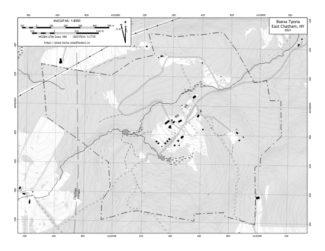

Вовча Тропа
===========

Color "USGS style" Topo
-----------------------
Mimics color schemes and symbols used in the popular and familiar USGS topo map
series.

.. list-table::
    :header-rows: 1

    *   - Page Size
        - Map Scale
        -
    *   - 8.5 x 11 (Letter)
        - 1:8000
        - `Download <https://github.com/amykyta3/plast-karto/releases/latest/download/VovchaTropa-USGS-8.5x11.pdf>`__
    *   - 24 x 36 (Arch D)
        - 1:2500
        - `Download <https://github.com/amykyta3/plast-karto/releases/latest/download/VovchaTropa-USGS-24x36.pdf>`__

Black & White Topo
------------------
Optimized for inexpensive black and white printing. Should hold up to
photocopying as well.

.. list-table::
    :header-rows: 1

    *   - Page Size
        - Map Scale
        -
    *   - 8.5 x 11 (Letter)
        - 1:8000
        - `Download <https://github.com/amykyta3/plast-karto/releases/latest/download/VovchaTropa-greyscale-8.5x11.pdf>`__

Data Sources and Attributions
-----------------------------
* Map author: Олесь Микита
* On-site surveys:

    * Олесь Микита - GPS tracks.
* Imagery and LiDAR datasets:

    * `NYS GIS Clearinghouse <http://gis.ny.gov>`_
    * nysdop5, nysdop7, nysdop8 Orthoimagery
    * NYSGPO LiDAR
* Parcel Boundaries:

    * `Columbia County SDG Map Portal <https://sdg.giscloud.com/map/311797/columbia>`_
